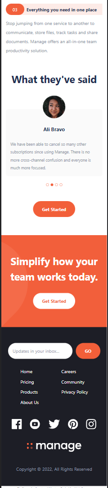

# Frontend Mentor - Manage landing page solution

This is a solution to the [Manage landing page challenge on Frontend Mentor](https://www.frontendmentor.io/challenges/manage-landing-page-SLXqC6P5). Frontend Mentor challenges help you improve your coding skills by building realistic projects.

## Table of contents

- [Overview](#overview)
  - [The challenge](#the-challenge)
  - [Screenshot](#screenshot)
  - [Links](#links)
- [My process](#my-process)
  - [Built with](#built-with)
  - [Useful resources](#useful-resources)
- [Author](#author)
- [Acknowledgments](#acknowledgments)

## Overview

### The challenge

Users should be able to:

- View the optimal layout for the site depending on their device's screen size
- See hover states for all interactive elements on the page
- See all testimonials in a horizontal slider
- Receive an error message when the newsletter sign up `form` is submitted if:
  - The `input` field is empty
  - The email address is not formatted correctly

### Screenshot

### Links

- Solution URL: [Github Repo](https://github.com/Boston343/manage-landing-page)
- Live Site URL: [https://webreaper-manage-landing-page.netlify.app/](https://webreaper-manage-landing-page.netlify.app/)

## My process

### Built with

- [Astro](https://astro.build/) - Website Framework
- [Tailwind CSS](https://tailwindcss.com/) - UI Framework
- [React](https://reactjs.org/) - JS library
- [Swiper](https://swiperjs.com/) - JS library
- Semantic HTML5 markup
- CSS custom properties
- Flexbox
- Mobile-first workflow

### Useful resources

- [CSS Filter Preview](https://codepen.io/sosuke/pen/Pjoqqp) - This helped me generate the appropriate filters for coloring the social icons on hover.
- [Tailwind CSS Video](https://www.youtube.com/watch?v=dFgzHOX84xQ) - This helped me learn Tailwind CSS, which I used in the making of this design.

## Author

- Website - [webreaper.dev](https://webreaper.dev/)
- Frontend Mentor - [@Boston343](https://www.frontendmentor.io/profile/Boston343)
- Twitter - [@BowTiedWebReapr](https://twitter.com/BowTiedWebReapr)

## Acknowledgments

Followed along Travery Media's free youtube tutorial on Tailwind CSS for parts of this. [Video Link](https://www.youtube.com/watch?v=dFgzHOX84xQ)
